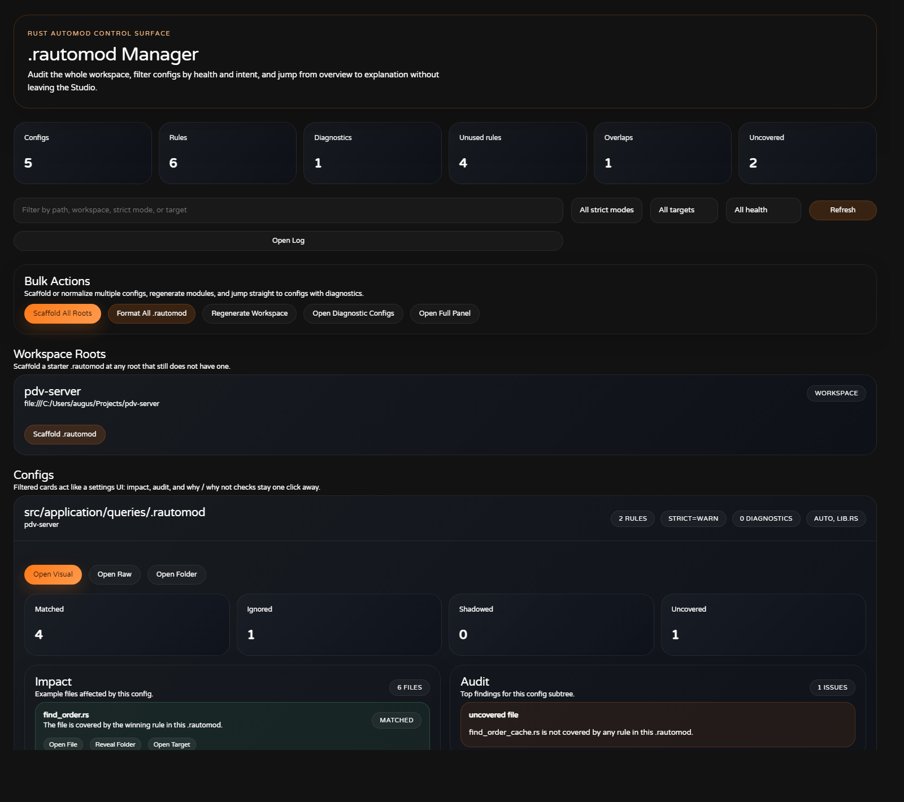
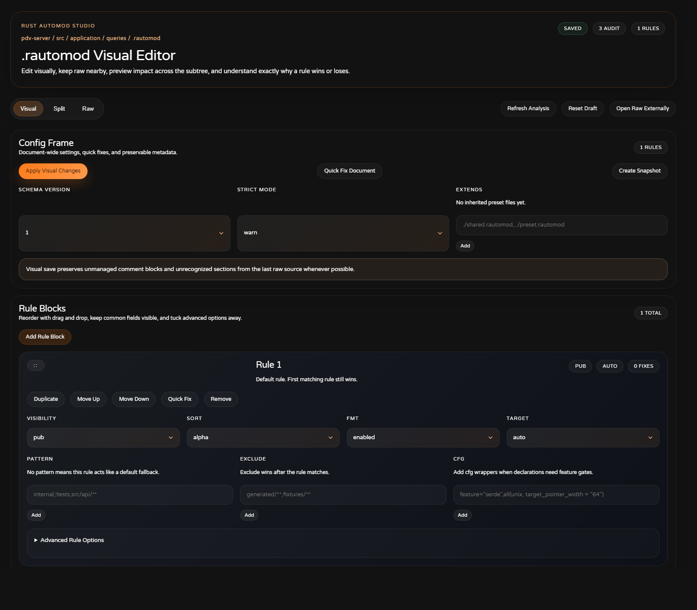

# Rust Automod


Art produced by [Saki](https://instagram.com/sak1_sk)

Rust Automod is a Visual Studio Code extension that keeps Rust module files in sync for you. It creates and updates `mod.rs`, `lib.rs`, and `main.rs` module declarations automatically, supports both the classic `folder/mod.rs` layout and the modern `folder.rs + folder/` layout, supports richer `.rautomod` project rules, adds syntax highlighting and formatting for `.rautomod`, and now includes smart `mod.rs` visibility controls plus preview, undo, regenerate, explain, module-tree, and Studio-style config workflows inside VS Code.

## Documentation

- For practical scenarios and copy-paste examples, see [docs/USE_CASES.md](docs/USE_CASES.md).
- For a more detailed `.rautomod` reference, see [docs/RAUTOMOD_REFERENCE.md](docs/RAUTOMOD_REFERENCE.md).
- For the visual editor and manager UI flows, see [docs/RAUTOMOD_STUDIO.md](docs/RAUTOMOD_STUDIO.md).

## What it does

- Creates `mod.rs` when a new Rust file appears in a module folder.
- Updates `mod.rs`, `lib.rs`, or `main.rs` when modules are added or removed.
- Detects whether a folder follows the classic `mod.rs` style or the modern `folder.rs + folder/` style.
- Can create a modern or classic module pair automatically, including the sibling file/folder structure.
- Supports nested folders and parent module registration.
- Supports `.rautomod` rules for visibility, sorting, target selection, excludes, inheritance, generated comments, strict validation, and more.
- Can run `cargo fmt` after updates.
- Adds a dedicated file icon, syntax highlighting, linting, completions, and formatting for `.rautomod`.
- Opens `.rautomod` in a custom visual editor with `Visual`, `Split`, and `Raw` modes.
- Includes a workspace-wide Rust AutoMod manager UI for browsing configs, filtering audits, scaffolding new ones, and visualizing the module tree.
- Supports preview/dry run, undo of the last automod action, workspace or folder regeneration, and structured logging.
- Can explain why a file was registered a certain way and show the effective config that won for a Rust file.
- Can scaffold a `.rautomod` file, ignore files or folders from the Explorer, and change module visibility from quick actions.
- Hides `mod.rs` more intelligently in the Explorer.

## How Rust AutoMod decides where to write

When Rust AutoMod reacts to a file or folder, it follows this general order:

1. It finds the effective `.rautomod` rule for the file, including inherited rules from `extends=...`.
2. It checks whether the file is ignored by `exclude=` or by a negative `pattern=!something`.
3. It resolves the target file:
   - `target=auto`: tries the crate root target when appropriate, otherwise detects classic `mod.rs` vs modern sibling `folder.rs`
   - `target=mod.rs`: always writes to the local folder `mod.rs`
   - `target=lib.rs`: writes to the nearest `lib.rs`
   - `target=main.rs`: writes to the nearest `main.rs`
4. It generates the declaration block according to `visibility`, `cfg`, `reexport`, `group_order`, and `blank_lines`.
5. It sorts or reorders the managed block according to `sort`.

If `strict=error` and the `.rautomod` file has blocking diagnostics, Rust AutoMod stops before applying those changes.

## New automod workflow features

- `Preview AutoMod Changes`: opens a dry-run summary and diff before writing.
- `Undo Last AutoMod Action`: restores the previous automod batch without relying on editor undo history.
- `Regenerate Rust Modules`: rebuilds missing registrations and removes stale ones for a folder or workspace.
- `Create Rust Module Pair`: scaffolds `name/mod.rs` or `name.rs + name/` based on the detected project style.
- `Set Module Visibility`: updates the parent declaration to `pub`, `pub(crate)`, or private without manually editing the parent file.
- `Move Module to Crate Root`: helps relocate a leaf module and rebuild declarations afterward.
- `Explain AutoMod Decision`: shows target file, winning rule, ordering, and generated snippet preview for a Rust file.
- `Show Effective AutoMod Config`: opens the resolved config, matched patterns, diagnostics, and source `.rautomod`.
- `Open Rust AutoMod Log`: opens the structured output channel with automod activity.
- `Ignore in .rautomod`: prepends an `exclude=` rule for a file or folder from the Explorer.
- `Scaffold .rautomod`: creates a starter config with the new keys and examples.
- Conflict detection warns when Rust AutoMod notices manual edits in the managed declaration area before writing again.

## Rust module layout support

Rust AutoMod now works with both major Rust module styles:

- Classic: `feature/mod.rs`
- Modern: `feature.rs` plus `feature/`

In `rustautomod.moduleLayout`, you can choose:

- `auto`: detect the style from the surrounding project structure
- `classic`: force `folder/mod.rs`
- `modern`: force `folder.rs + folder/`

This affects:

- where `target=auto` writes declarations
- what `Create Rust Module Pair` scaffolds
- how folder modules appear in the manager module tree
- how regeneration detects stale declarations

Example modern layout:

```text
src/
  lib.rs
  application.rs
  application/
    queries.rs
    services.rs
```

With this structure, Rust AutoMod can keep `src/lib.rs` and `src/application.rs` synchronized without depending on `mod.rs`.

## Rust AutoMod Studio UI

Rust AutoMod now treats `.rautomod` as a first-class editing surface instead of only a plain text file.

There are two UI entry points:

1. A per-file visual editor for each `.rautomod`
2. A manager surface for browsing configs across the workspace

### Visual editor for each `.rautomod`

Each `.rautomod` file can open in a custom editor with three modes:

- `Visual`: form-based editing for rule blocks and global config
- `Split`: visual cards side-by-side with the raw text
- `Raw`: a focused text area for manual edits

The visual editor exposes:

- `schema_version`, `strict`, and `extends`
- rule cards for `visibility`, `sort`, `fmt`, `target`, `pattern`, `exclude`, `cfg`, `group_order`, `blank_lines`, `reexport`, `header`, and `generated_comment`
- live audit and diagnostics feedback from the extension parser
- inline quick fixes for document and rule fields
- chip-based editors for `pattern`, `exclude`, `cfg`, and `extends`
- drag-and-drop rule ordering, plus duplicate, remove, and move actions
- impact preview showing matched, ignored, shadowed, and uncovered files
- a matching playground that explains why a path is matched, ignored, or uncovered
- local snapshot history for the current `.rautomod`
- real draft-state badges so you can see when Visual and Raw diverge
- `Format Raw`, `Apply Raw Changes`, and `Open Raw Externally`

### Manager UI

Use `Open Rust AutoMod Manager` to open a central panel, or open the Rust AutoMod activity bar container to access the manager view.

The manager UI gives you:

- a workspace-wide list of `.rautomod` files
- quick search by path, workspace, strict mode, or target mode
- summary cards for configs, rules, diagnostics, uncovered files, and overlaps
- direct actions to open a config visually or in raw mode
- scaffold actions for workspace roots
- bulk actions to scaffold all roots, format all `.rautomod` files, regenerate the workspace, and open configs with diagnostics
- per-config audit cards with duplicate-rule, overlap, ignored, shadowed, and uncovered signals
- per-config impact samples with open-file and reveal-folder actions
- a manager-side why/why-not playground for testing individual paths
- a visual module tree built from crate roots and actual `mod` declarations
- quick actions on module-tree nodes to create child modules, switch visibility, open files, or move a leaf module to the crate root
- quick access to the Rust AutoMod log

This manager is meant to feel closer to a product control surface, similar in spirit to a settings UI, while still keeping the actual `.rautomod` file as the source of truth.

### Studio gallery

The screenshots below use the `pdv-server` example workspace.

Manager view:



Visual editor for `src/application/queries/.rautomod`:



Split mode for the same config:


## New mod.rs visibility features

Rust Automod now supports three Explorer workflows for `mod.rs`:

1. Smart hide for all index-like `mod.rs`
2. Manual hide for one specific `mod.rs`
3. Restore for both flows

### Smart hide

Use the command `Toggle Smart mod.rs Hiding`.

When it is enabled, the extension hides only `mod.rs` files that behave like lightweight indexes, such as files containing only:

- `mod foo;`
- `pub mod foo;`
- `#[cfg(...)]` attributes attached to those declarations
- `pub use ...;` re-exports

If a `mod.rs` contains real code, like functions, structs, impls, constants, inline modules with bodies, or any other implementation content, it stays visible.

### Manual hide

Right-click a `mod.rs` file in the Explorer and run:

- `Hide This mod.rs`

This hides only that file.

### Restore

To restore hidden files, use:

- `Restore Hidden mod.rs`

If you run it from the Explorer on a specific `mod.rs`, it restores that file directly.
If you run it from the Command Palette, the extension shows a picker with the manually hidden `mod.rs` files.

## Commands

- `Toggle Smart mod.rs Hiding`
- `Hide This mod.rs`
- `Restore Hidden mod.rs`
- `Preview AutoMod Changes`
- `Regenerate Rust Modules`
- `Undo Last AutoMod Action`
- `Explain AutoMod Decision`
- `Show Effective AutoMod Config`
- `Ignore in .rautomod`
- `Scaffold .rautomod`
- `Create Rust Module Pair`
- `Set Module Visibility`
- `Move Module to Crate Root`
- `Open Rust AutoMod Log`
- `Open .rautomod Visual`
- `Open .rautomod Raw`
- `Open Rust AutoMod Manager`

## Command workflows

### Preview before writing

Use `Preview AutoMod Changes` on a Rust file or folder when you want to inspect what would change first. Rust AutoMod opens a summary plus a diff of the first affected file without writing to the workspace.

If you want this behavior automatically before every write, enable the setting:

```json
{
  "rustautomod.previewBeforeApply": true
}
```

### Rebuild stale module trees

Use `Regenerate Rust Modules` when:

- you moved many files outside VS Code
- a branch switch left stale declarations behind
- you want to rebuild a whole folder after changing `.rautomod`

This command scans the selected folder or workspace, re-adds missing declarations, and removes stale ones.

### Create classic or modern module pairs

Use `Create Rust Module Pair` on a folder when you want Rust AutoMod to scaffold the next module correctly for the surrounding project style.

Depending on detection or your `rustautomod.moduleLayout` setting, it creates either:

- `orders/mod.rs`
- `orders.rs` plus `orders/`

It also registers the new module in the correct parent target and asks for the visibility up front.

### Change visibility and move modules

Use:

- `Set Module Visibility` to switch an existing module declaration between `pub`, `pub(crate)`, and private
- `Move Module to Crate Root` when you want to pull a leaf module upward and then let Rust AutoMod rebuild declarations

These flows are also exposed from the Studio manager module tree when applicable.

### Explain and inspect

Use these two commands together when a result looks surprising:

- `Explain AutoMod Decision`: shows why Rust AutoMod chose a target and what lines it wants to generate
- `Show Effective AutoMod Config`: shows the winning rule, matched patterns, diagnostics, and config source

### Ignore noisy paths

Right-click a file or folder and use `Ignore in .rautomod` to prepend an `exclude=` rule to the workspace `.rautomod`. This is especially useful for:

- generated code
- fixtures
- snapshots
- migration folders
- vendored examples

### Edit `.rautomod` visually

Open any `.rautomod` file to work in the visual editor. Use `Split` when you want to see both the rule cards and the raw text at the same time.

The visual editor is especially useful when:

- you are creating a config for the first time
- you want to compare multiple rule blocks quickly
- you want guardrails around valid values such as `visibility`, `sort`, or `target`
- you want diagnostics visible while editing
- you want impact preview and rule-playground feedback without leaving the file
- you want to preserve unmanaged comments while still editing visually

If you want a broader workspace view, run `Open Rust AutoMod Manager` to open the central panel and jump into a config from there.

## .rautomod configuration

Place a `.rautomod` file at the root of your Rust project, or inside a subfolder, to customize behavior.

The file is now recognized as its own VS Code language, with a dedicated Explorer icon, colors for comments, keys, operators, known values, `cfg(...)` expressions, and list entries. You can run `Format Document` on `.rautomod` files to normalize spacing, assignment style, blank lines, and comma-separated lists, and the extension now provides quick fixes for invalid keys and common missing entries.

If you prefer a GUI instead of editing raw text, open the file in the built-in visual editor. The visual editor still writes back to the same `.rautomod` text file, so Git history, diffs, merges, and manual editing continue to work normally.

Visual saves now try to preserve:

- leading comment blocks
- unmanaged blocks that are not recognized as Rust AutoMod keys
- comments attached to managed document/rule blocks

For a line-by-line explanation of every key, precedence rule, and matching behavior, see [docs/RAUTOMOD_REFERENCE.md](docs/RAUTOMOD_REFERENCE.md).

Example:

```rautomod
visibility=pub
sort=alpha
fmt=enabled
target=auto
```

Available keys:

- `visibility=pub|private|pub(crate)|pub(super)`
- `sort=alpha|alpha_case_insensitive|none|pub_first|cfg_first`
- `fmt=enabled|disabled`
- `target=auto|mod.rs|lib.rs|main.rs`
- `exclude=generated/**,tests/**`
- `cfg=feature="serde",all(unix, target_pointer_width = "64")`
- `pattern=utils,helpers,!tests`
- `group_order=use,cfg,pub_mod,mod,pub_use`
- `blank_lines=0|1|2`
- `reexport=enabled|disabled`
- `header=generated by rustautomod`
- `generated_comment=managed by rustautomod`
- `strict=off|warn|error`
- `schema_version=1`
- `extends=./shared.rautomod`

Example with inheritance, excludes, and generated comments:

```rautomod
schema_version=1
strict=warn
extends=./shared.rautomod
visibility=pub
sort=alpha
fmt=enabled
target=auto
group_order=use,cfg,pub_mod,mod,pub_use
blank_lines=1
reexport=disabled
generated_comment=managed by rustautomod

pattern=internal,!tests
visibility=private
sort=alpha_case_insensitive
exclude=generated/**
reexport=enabled
```

### Rule behavior

- `pattern` supports negative entries with `!`.
- `exclude` marks matching files or folders as ignored by Rust AutoMod.
- `extends` resolves relative to the current `.rautomod`.
- `target` lets a rule choose `mod.rs`, `lib.rs`, `main.rs`, or automatic resolution.
- `group_order` controls how managed declarations are grouped relative to `use`, `cfg`, public/private modules, and generated `pub use`.
- `blank_lines` controls spacing between managed groups.
- `strict=error` makes validation strict enough for diagnostics to block automod actions that rely on the config file.

## Example gallery

Here are a few common shapes that Rust AutoMod handles well:

### Simple library crate

```text
src/
  lib.rs
  api.rs
  config.rs
```

With `target=auto`, Rust AutoMod can keep `src/lib.rs` updated with:

```rust
pub mod api;
pub mod config;
```

### Folder with private internals

```rautomod
pattern=internal,!tests
visibility=private
sort=alpha_case_insensitive
```

This is useful when you want helper folders to stay internal even if the rest of the crate is public.

### Platform-specific module declarations

```rautomod
pattern=platform
cfg=unix,windows
visibility=pub
```

This generates `#[cfg(...)]` attributes before the managed declarations for matching modules.

### Generated folders you never want touched

```rautomod
exclude=generated/**,fixtures/**
```

Rust AutoMod resolves the config but skips writes for matching files and folders.

### Re-export based module surfaces

```rautomod
pattern=prelude
reexport=enabled
generated_comment=managed by rustautomod
```

This is handy for folders where the module file should both declare and re-export submodules.

For more complete, real-world examples, see [docs/USE_CASES.md](docs/USE_CASES.md).

## Installation

1. Open VS Code.
2. Open Extensions.
3. Search for `Rust AutoMod`.
4. Install and reload the editor.

## Usage

1. Open a Rust project with a `Cargo.toml`.
2. Optionally add a `.rautomod` file.
3. Create or delete `.rs` files inside your module folders.
4. Use `Preview AutoMod Changes` when you want a dry run and diff.
5. Use `Regenerate Rust Modules` to rebuild a folder or workspace.
6. Use the Explorer commands when you want to hide or restore `mod.rs`, ignore paths, or scaffold `.rautomod`.
7. Use `Explain AutoMod Decision` and `Show Effective AutoMod Config` when you want to understand why a file was handled a certain way.

## Internal structure

The extension was refactored so each responsibility lives in a smaller module.

### Automod core

- `src/automod/automodModFile.ts`: orchestration for create, delete, rename, regenerate, preview, explain, ignore, and scaffold flows
- `src/automod/automodRuntime.ts`: shared runtime for preview, diff, undo history, conflict detection, and batch application
- `src/automod/modDeclarations.ts`: parsing and generation of module declaration blocks
- `src/automod/modContentEditor.ts`: insertion, removal, and sorting of declaration content
- `src/automod/modFileSystem.ts`: async file-system helpers and target-file resolution
- `src/automod/cargoFmt.ts`: isolated `cargo fmt` integration
- `src/automod/automodConfigFile.ts`: `.rautomod` parsing, inheritance, pattern matching, and effective-config resolution

### Visibility and workspace state

- `src/workbench/control.ts`: Explorer command/controller flow
- `src/workbench/modVisibility.ts`: index-like `mod.rs` detection and exclude reconciliation
- `src/workbench/modVisibilityWorkspaceService.ts`: per-workspace visibility persistence and `files.exclude` sync
- `src/workspace/workspaceStateService.ts`: generic workspace-scoped state storage
- `src/workspace/automodLogger.ts`: structured output channel logging
- `src/workspace/automodHistoryService.ts`: undo stack for automod batches

### .rautomod editor support

- `src/linting/linting.automod.ts`: `.rautomod` diagnostics and strict-mode severity handling
- `src/linting/linting.codeActions.ts`: quick fixes for invalid keys and common missing entries
- `src/linting/linting.completion.ts`: completions for the expanded `.rautomod` key set
- `src/linting/linting.formatting.ts`: document formatting provider for `.rautomod`
- `src/ui/rautomodCustomEditor.ts`: per-file custom editor with visual, split, and raw workflows
- `src/ui/rautomodManagerView.ts`: workspace manager sidebar and full manager panel
- `src/ui/rautomodState.ts`: view-model shaping for the UI layer
- `src/ui/rautomodWebviewTemplates.ts`: shared HTML shell for the Rust AutoMod Studio webviews
- `media/rautomodWebview.css`: shared product-style UI styling for the manager and editor
- `media/rautomodEditorWebview.js`: front-end logic for the per-file visual editor
- `media/rautomodManagerWebview.js`: front-end logic for the manager UI

## Development

### Scripts

- `yarn compile`
- `yarn lint`
- `yarn test:unit`
- `yarn test`
- `yarn screenshots:studio`

### Test coverage

The project now includes:

- unit tests for visibility heuristics
- unit tests for `mod.rs` content editing
- unit tests for `.rautomod` formatting
- config-resolution tests for `.rautomod` inheritance, negation, and excludes
- config-serialization tests for comment and unmanaged-block preservation
- extension integration tests for Explorer commands and `files.exclude`
- extension integration tests for `.rautomod` language detection and formatting
- extension integration tests for scaffold, ignore, preview, regenerate, undo, and effective config inspection
- extension integration tests for modern module layout detection, module-pair creation, and manager module-tree rendering
- the existing debounce and rename-detection suites

## Notes

- `fmt=enabled` requires `cargo` and `rustfmt` to be available in your environment.
- If no `.rautomod` file is found, Rust Automod falls back to VS Code settings under `rustautomod.*`.
- `target=lib.rs` and `target=main.rs` are most useful for crate-root style rules.
- The extension ignores invalid or unsafe paths such as `.git`, `target`, `node_modules`, and similar folders.
- Some icon themes may override the default `.rautomod` icon contributed by the extension.
- Visual saves still normalize managed `.rautomod` structure, but now try to preserve leading comments, unmanaged blocks, and comments attached to managed sections. `Raw` and `Split` are still the safest modes when exact hand-tuned formatting matters.

Contributions, issues, and feature requests are welcome.
